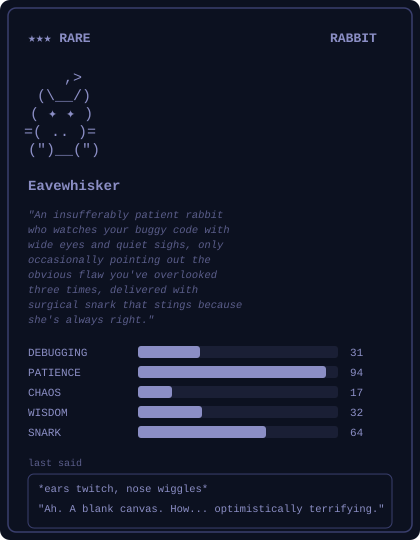

I make LLMs do real work. Python backend engineer, 8+ years in.

```
lately:  shipping enterprise AI on Azure, leading a 6-person dev team
before:  built the rider app backend at Yogiyo
side:    ran a solo LLM consultancy — 160 clients, 4.9★
```

I like to wow people with what AI can do.

### My Claude Code Buddy

<picture>
  
</picture>

[linkedin](https://www.linkedin.com/in/changhyun-an-240b71116/) · [email](mailto:88soldieron@gmail.com)
